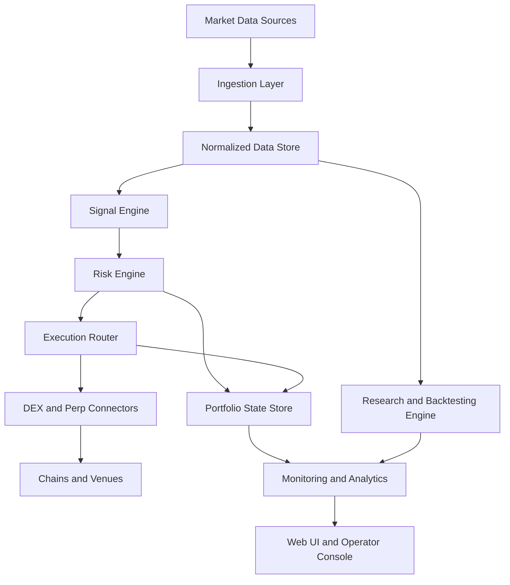

# DeFi Trading Bot Platform Plan

## Goal

Build a production-grade, personal-use DeFi crypto trading bot platform inspired by [`jesse`](https://github.com/jesse-ai/jesse) and [`freqtrade`](https://github.com/freqtrade/freqtrade), optimized for continuous operation, low-fee execution, robust research workflows, interactive charting, strong risk controls, and live on-chain trading.

## Planning assumptions

- Starting capital is approximately $100.
- The platform is for personal use, so multi-tenant complexity is unnecessary.
- The strongest first implementation path is EVM-first with chain-agnostic abstractions.
- Low fees matter, so phase one should prefer low-cost chains and venues over Ethereum mainnet-first execution.
- The product should support the full lifecycle: research, simulation, paper trading, live execution, monitoring, and post-trade analysis.
- Strategy selection and execution design must prioritize net profitability after gas, slippage, and fees, especially because a small account is highly sensitive to cost leakage.
- A target of 10% profit per day should be treated as an aspirational objective rather than a planning assumption, because building a system around that expectation would force excessive leverage, overtrading, or fragile strategy design.

## Capital profile and return-target implications

### Starting account profile

With an initial capital base near $100, the platform architecture and the strategy roadmap should optimize for:

- very low fees and low gas environments
- small notional position sizing
- strict avoidance of overtrading
- high selectivity in trade entry
- incremental compounding only after paper and live validation

### Important planning consequence

A sustained 10% daily return target is not a realistic engineering baseline for a robust trading platform. If the system is designed around that target, it will likely become:

- overfit in research
- overaggressive in live execution
- too sensitive to slippage and gas costs
- structurally exposed to blow-up risk

The safer planning approach is:

- optimize for positive expectancy after all costs
- target highly selective trading instead of constant activity
- make capital preservation the first hard requirement
- treat compounding as an output of edge plus discipline, not as a fixed daily promise

### What this changes in the build plan

For a small starting account, the early platform should emphasize:

- chains and venues with consistently low transaction cost
- fewer, higher-conviction strategies rather than broad market coverage
- spot and lightly leveraged directional execution before complex hedged structures
- detailed fee, gas, and slippage attribution in every backtest and live report
- strong pause rules when estimated edge does not materially exceed transaction costs

## Recommended phase-one market focus

### Execution domain

Start with EVM-compatible low-fee chains:

- Arbitrum
- Base
- Optimism
- BNB Chain as optional later addition

Avoid full multi-chain expansion at the beginning. Design the platform so additional chains can be plugged in later.

### Venue focus

Support these venue categories first:

- DEX aggregators for spot execution
- Perpetual DEXs for directional strategies
- Major protocol-specific APIs and subgraphs for market state and liquidity signals

### Why this first

- Lower gas costs improve net profitability for retail-sized trades.
- EVM tooling is mature for wallets, RPCs, event indexing, and simulation.
- Aggregators reduce routing complexity early.
- Perpetual DEXs and spot DEXs together give broader strategy coverage.

## Top 3 strategy categories to prioritize

These are not guaranteed profitable. They are the three highest-value strategy families to build first because they can be researched, simulated, risk-managed, and improved systematically.

### 1. Trend plus momentum breakout strategy

Best use:

- Liquid majors and high-volume pairs
- Spot and perp markets
- Higher timeframes from 5m to 4h

Why prioritize:

- Easier to backtest cleanly than many pure DeFi microstructure strategies
- Works well with indicator-driven workflows and interactive charts
- Lower operational complexity than arbitrage
- Good baseline strategy family for the platform

Core signals:

- EMA regime filters
- ADX or trend strength filters
- Breakout above volatility-adjusted ranges
- Volume confirmation
- ATR-based stop and trailing logic

Required controls:

- Regime detection to avoid choppy markets
- Position sizing by volatility
- Daily drawdown cap
- Slippage-aware entry rejection

### 2. Mean reversion plus market regime rotation strategy

Best use:

- Range-bound markets
- Highly liquid spot pairs
- Intraday and swing timeframes

Why prioritize:

- Complements trend following and diversifies return profile
- Efficient for lower-fee environments when carefully filtered
- Very suitable for indicator overlays and parameter optimization

Core signals:

- Bollinger Band excursions
- RSI or z-score deviations
- VWAP distance and reversion triggers
- Volatility compression and expansion filter
- Session or time-window filters

Required controls:

- Trend filter to disable during strong directional moves
- Time-in-trade limit
- Re-entry cooldown
- Dynamic profit targets tied to realized volatility

### 3. Cross-venue DeFi spread and funding-capture strategy

Best use:

- Perp DEXs versus spot DEXs
- Same-asset exposure across venues
- Opportunities driven by basis, funding, or temporary pricing dislocations

Why prioritize:

- Strongest path toward DeFi-native edge
- More defensible than generic retail indicators alone
- Can exploit structure specific to on-chain and perp venues

Core signals:

- Spot-perp basis divergence
- Funding rate extremes
- Cross-DEX price dislocation after fees and gas
- Liquidity imbalance and oracle lag detection

Required controls:

- Strict fee and gas profitability threshold
- Execution atomicity where possible
- Venue health and liquidity checks
- Inventory and hedge drift monitoring

### Strategy order of implementation

1. Trend plus momentum breakout
2. Mean reversion plus market regime rotation
3. Cross-venue spread and funding capture

This order builds research and execution maturity before moving into more fragile microstructure strategies.

## Product vision

The platform should behave like a research lab, execution engine, and operator console in one system.

### Core product surfaces

- Research workspace
- Strategy builder and strategy registry
- Interactive charting and indicator studio
- Backtesting engine
- Paper trading environment
- Live trading control center
- Portfolio and PnL dashboard
- Risk and safeguards console
- Alerting and observability workspace
- Run history and trade journal

## Target architecture

## System modules

### 1. Market data and ingestion

Responsibilities:

- Pull OHLCV and tick-like trade data where available
- Subscribe to websocket market streams when supported
- Ingest funding rates, open interest, liquidity snapshots, gas metrics, and oracle prices
- Normalize all venue-specific payloads into a common schema
- Persist both raw and derived datasets

Data classes:

- Candle data across multiple timeframes
- Trade prints and book snapshots where feasible
- On-chain pool state and liquidity depth
- Funding and basis metrics
- Wallet balances and token prices
- Gas prices and chain health

Design requirements:

- Backfill plus realtime streaming
- Idempotent ingestion
- Replayable event log for simulation
- Clear source provenance and timestamp handling

### 2. Research and strategy development

Responsibilities:

- Define strategies as modular components
- Support indicators, feature engineering, entry rules, exit rules, and filters
- Allow parameter sweeps and comparative experiments
- Track experiment metadata and results

Strategy abstraction should include:

- Market universe selection
- Timeframe dependencies
- Indicator pipeline
- Signal generation logic
- Position sizing logic
- Exit and stop logic
- Risk guardrails
- Strategy tags and versioning

### 3. Backtesting engine

Responsibilities:

- Replay historical data with realistic fees, gas, slippage, and latency assumptions
- Simulate spot and perp positions
- Support walk-forward validation
- Produce detailed performance analytics

Required features:

- Fill models for DEX and perp venues
- Gas-aware profitability checks
- Funding and borrowing cost accounting
- Partial fill and execution failure simulation
- Portfolio-level and strategy-level reporting

Performance outputs:

- Net PnL
- Sharpe and Sortino style metrics
- Max drawdown
- Profit factor
- Exposure by asset and venue
- Slippage attribution
- Fee and gas attribution
- Trade distribution by regime

### 4. Paper trading engine

Responsibilities:

- Run strategies continuously against live data without real execution
- Simulate fills using current liquidity and fee assumptions
- Compare paper results with expected backtest behavior

Purpose:

- Validate signal freshness
n- Verify end-to-end orchestration
- Detect data drift and execution model gaps before live deployment

### 5. Live execution engine

Responsibilities:

- Convert approved intents into executable orders or swaps
- Route trades through connectors and aggregators
- Handle retries, nonce issues, transaction tracking, and post-trade reconciliation

Key components:

- Execution planner
- Router selection logic
- Transaction builder and signer integration
- Broadcast monitor
- Fill reconciler
- Failure recovery workflow

Execution safeguards:

- Pre-trade profitability check after fees and gas
- Max slippage thresholds
- Min liquidity thresholds
- Max gas price threshold
- Chain congestion pause logic
- Circuit breakers by venue and strategy

### 6. Risk engine

Responsibilities:

- Enforce portfolio, strategy, trade, and venue-level constraints
- Stop the bot when invariant violations occur

Controls should include:

- Max capital at risk per trade
- Max concurrent positions
- Max exposure per chain, token, and venue
- Daily and rolling drawdown limits
- Loss streak pause
- Volatility spike throttle
- Stablecoin depeg detection
- Oracle deviation checks
- Wallet reserve minimums for gas and collateral

### 7. Portfolio and state management

Responsibilities:

- Track wallet balances, open positions, pending orders, realized and unrealized PnL
- Maintain canonical state even when connectors disagree or chains lag

Requirements:

- Event-sourced trade lifecycle tracking
- Deterministic reconciliation jobs
- Manual override support for personal operations

### 8. Observability and analytics

Responsibilities:

- Provide logs, metrics, traces, alerts, run summaries, and anomaly detection
- Explain why trades were or were not placed

Key observability outputs:

- Strategy heartbeat
- Signal counts and acceptance rates
- Execution latency
- Failure rates by connector
- PnL by strategy and market
- Drift between backtest, paper, and live performance

### 9. UI and operator console

Responsibilities:

- Serve as the control plane and analysis surface for the platform

Main UI modules:

- Overview dashboard
- Strategy registry and run controls
- Interactive charting workspace
- Indicator overlay manager
- Backtest result explorer
- Live trade blotter
- Position monitor
- Risk panel
- System health console
- Journaling and export tools

## Interactive charting and indicator requirements

This is a major product requirement, not a nice-to-have.

### Charting capabilities

- Multi-timeframe candlestick charts
- Overlay indicators such as EMA, SMA, VWAP, Bollinger Bands, support and resistance, anchored VWAP
- Lower-panel indicators such as RSI, MACD, ADX, ATR, volume profile approximations, funding rate, open interest, and custom factors
- Drawing tools for zones, trend lines, and annotations
- Strategy signal markers for entries, exits, stops, take profits, and rejected orders
- Replay mode for historical bar-by-bar analysis
- Linked crosshair and synchronized multi-chart layouts
- Trade and regime annotations on the chart

### Indicator architecture

- Declarative indicator definitions
- Computation service for batch and incremental updates
- Cached series output for UI performance
- Ability to compare multiple parameter sets visually

### Backtest visualization requirements

- Equity curve and drawdown panels
- Trade list linked to chart events
- Regime segmentation overlays
- Fee and slippage attribution panels
- Parameter comparison heatmaps

## Recommended technical architecture

### Application structure

Use a modular monolith first, with clean package boundaries. Do not begin with microservices.

Recommended high-level modules:

- `apps/web` for the operator UI and API surface
- `apps/worker` for ingestion, backtests, paper trading, and live execution jobs
- `packages/core` for shared domain models and strategy contracts
- `packages/connectors` for chain, wallet, venue, and data-source adapters
- `packages/indicators` for technical analysis and custom features
- `packages/backtest` for simulation logic and performance analytics
- `packages/risk` for rules and guardrails
- `packages/ui-charts` for charting components

### Technology choices

#### Frontend

- Next.js for the operator console
- React component architecture
- TradingView Lightweight Charts or a similar high-performance charting layer
- Zustand or equivalent for local trading UI state
- Server actions or API routes for control-plane interactions

#### Backend and workers

Two valid paths exist:

1. Stay TypeScript-first for a unified stack
2. Use Python for strategy research and backtesting while keeping the web UI in TypeScript

For the most comprehensive long-term system, use a hybrid architecture:

- TypeScript for UI, APIs, orchestration, connectors where practical, and realtime operator tooling
- Python for research notebooks, strategy prototyping, hyperparameter search, and possibly the backtesting engine if quantitative workflows become heavy

If you want one language only, choose TypeScript first for operational simplicity.

#### Data storage

- PostgreSQL for canonical relational state
- Timeseries partitioning strategy for candles, signals, trades, and metrics
- Redis for queues, locks, ephemeral caches, and realtime pub-sub
- Object storage for large historical datasets, snapshots, and exported backtest artifacts

#### Messaging and scheduling

- Queue-based workers for ingestion, signal evaluation, execution, and reconciliation
- Cron-like scheduler for periodic jobs
- Event bus pattern inside the app boundary

#### Blockchain and market integrations

- RPC provider abstraction with failover
- Wallet signer abstraction separating hot and cold operational models
- Venue connector interfaces for DEX aggregators and perp DEXs
- Indexer adapters for subgraphs and protocol APIs

## Data model domains

Core entities should include:

- Asset
- Chain
- Venue
- Market
- Candle
- FundingSnapshot
- LiquiditySnapshot
- StrategyDefinition
- StrategyVersion
- BacktestRun
- PaperRun
- LiveRun
- SignalEvent
- TradeIntent
- ExecutionAttempt
- Fill
- Position
- PortfolioSnapshot
- RiskEvent
- AlertEvent
- SystemHeartbeat

## Security and operational hardening

Because this is a live DeFi trading system, these are mandatory.

### Wallet and key management

- Separate research environment from live wallet environment
- Distinct wallets per strategy family where feasible
- Encrypted key storage and strict access boundaries
- Ability to rotate wallets and revoke connectors quickly
- Prefer signer abstraction that can later support hardware-backed or remote signing

### Runtime safety

- Dry-run mode always available
- Kill switch in UI and CLI
- Venue-specific circuit breakers
- Chain halt and RPC health detection
- Reconciliation before allowing restart after failure

### Auditability

- Every decision logged with strategy version and input context
- Every order intent linked to risk checks and execution outcome
- Immutable run history and manual action log

## Deployment model

### Environments

- Local development
- Research and simulation environment
- Paper trading environment
- Live trading environment

### Recommended runtime topology

- Web app for control plane
- Worker process pool for jobs
- PostgreSQL database
- Redis instance
- Optional separate analytics notebook environment

### Hosting approach

For personal use, keep the initial deployment simple:

- Managed PostgreSQL
- Managed Redis
- Containerized web and worker services
- Secret manager for RPC keys and wallet materials
- Basic dashboards and alert channels

## Phase roadmap

### Phase 0. Foundations and requirements

Deliverables:

- Final product scope
- Chain and venue selection
- Domain model draft
- Risk policy draft
- Repo structure decision
- Environment and secret strategy

Exit criteria:

- You can describe exactly what a strategy, signal, trade intent, fill, and run mean in the system.

### Phase 1. Core platform skeleton

Deliverables:

- Monorepo or clean workspace structure
- Shared domain types
- Config system
- PostgreSQL schema baseline
- Redis and worker scaffolding
- Auth and operator access pattern for personal use
- Initial dashboard shell

Exit criteria:

- System boots locally with web plus workers plus database.

### Phase 2. Market data platform

Deliverables:

- Connectors for selected chains and venues
- Candle ingestion pipeline
- Funding and liquidity ingestion
- Normalized market schema
- Realtime stream handling
- Historical data backfill pipeline

Exit criteria:

- Historical and live data are queryable and trustworthy enough for strategy research.

### Phase 3. Indicator and charting foundation

Deliverables:

- Indicator computation service
- Interactive candlestick charting module
- Overlay and sub-panel indicators
- Replay mode baseline
- Signal annotation layer

Exit criteria:

- You can visually inspect indicators and signals on historical and current data.

### Phase 4. Backtesting engine

Deliverables:

- Strategy contract and execution lifecycle
- Historical simulator
- Fee, gas, and slippage models
- Metrics and report generator
- Result explorer UI

Exit criteria:

- You can run a full backtest and inspect results with trade-level detail.

### Phase 5. Strategy implementation wave 1

Deliverables:

- Trend plus momentum breakout implementation
- Mean reversion plus regime rotation implementation
- Shared filters and sizing primitives
- Experiment comparison tools

Exit criteria:

- Two primary strategies can be backtested, compared, and tuned in a repeatable workflow.

### Phase 6. Paper trading and realtime validation

Deliverables:

- Live signal evaluation loop
- Paper execution simulator
- Drift analytics versus backtest assumptions
- Alerting on failures and anomalies

Exit criteria:

- Strategies can run continuously without placing real trades.

### Phase 7. Live execution infrastructure

Deliverables:

- Wallet and signer integration
- Router abstraction
- Trade intent pipeline
- On-chain execution monitor
- Reconciliation jobs
- Circuit breakers and kill switch

Exit criteria:

- A single low-risk strategy can execute live with full observability and rollback controls.

### Phase 8. Strategy implementation wave 2

Deliverables:

- Cross-venue spread and funding-capture strategy
- Venue health and basis monitor
- Hedge and inventory controls

Exit criteria:

- The first DeFi-native edge strategy is live-capable in controlled size.

### Phase 9. Portfolio and optimization layer

Deliverables:

- Multi-strategy capital allocator
- Correlation-aware exposure controls
- Performance decomposition dashboard
- Strategy enable and disable automation by regime

Exit criteria:

- Capital can be allocated across strategies with portfolio-level controls.

### Phase 10. Hardening and operator excellence

Deliverables:

- Full alert catalog
- Failure recovery playbooks
- Backup and restore process
- Runbooks for chain issues, RPC outages, and wallet anomalies
- Comprehensive journaling and export tools

Exit criteria:

- The platform is robust enough for unattended but supervised operation.

## Suggested build order inside each major subsystem

### Data first

Build in this order:

1. Candle ingestion
2. Funding and basis ingestion
3. Liquidity and venue metadata
4. Wallet and portfolio state
5. Realtime event pipeline

### Strategy first

Build in this order:

1. Shared indicator library
2. Strategy contract
3. Trend strategy
4. Mean reversion strategy
5. Spread and basis strategy

### Execution first

Build in this order:

1. Paper execution
2. Intent and risk approval pipeline
3. Single venue live execution
4. Multi-venue routing
5. Recovery and reconciliation

## Minimum non-negotiable dashboards

- System health dashboard
- Strategy performance dashboard
- Portfolio and exposure dashboard
- Trade blotter and execution dashboard
- Risk events dashboard
- Chain and venue health dashboard

## Metrics that matter most

- Net return after fees and gas
- Maximum drawdown
- Win rate by regime
- Average adverse excursion
- Slippage and gas per trade
- Fill failure rate
- Strategy uptime
- Signal-to-trade conversion rate
- Portfolio utilization
- Basis capture after costs

## Major risks to design around

- Overfitting from indicator-heavy research
- False confidence from unrealistic backtests
- Hidden cost leakage from slippage and gas
- On-chain execution failure during volatile periods
- RPC dependency concentration
- Oracle anomalies and venue outages
- Stablecoin and collateral risk
- Strategy crowding and edge decay

## What to avoid early

- Too many chains at once
- Too many venues at once
- Unsupported high-frequency assumptions
- Immediate autonomous live trading without paper validation
- Building a complex ML stack before a reliable rule-based platform exists
- Microservice fragmentation before domain boundaries are proven

## Recommended final direction

Build an EVM-first, low-fee, modular DeFi trading platform with:

- robust market-data ingestion
- institutional-style backtesting discipline
- chart-centric research workflows
- strong risk and reconciliation controls
- staged progression from backtest to paper to live
- initial strategy concentration on trend, mean reversion, and basis-spread opportunities

This best aligns with the goal of creating a profitable personal-use platform while keeping the engineering effort grounded in realistic execution constraints.
